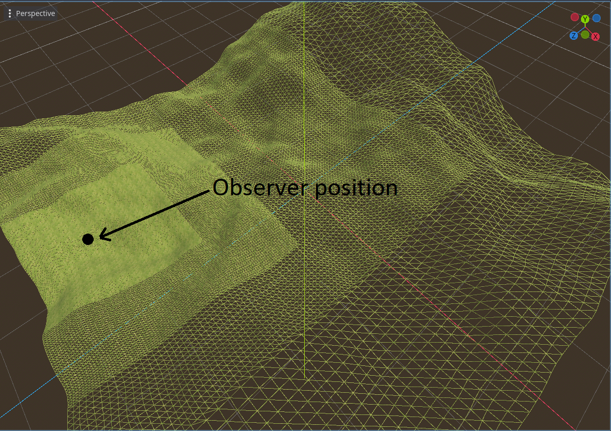
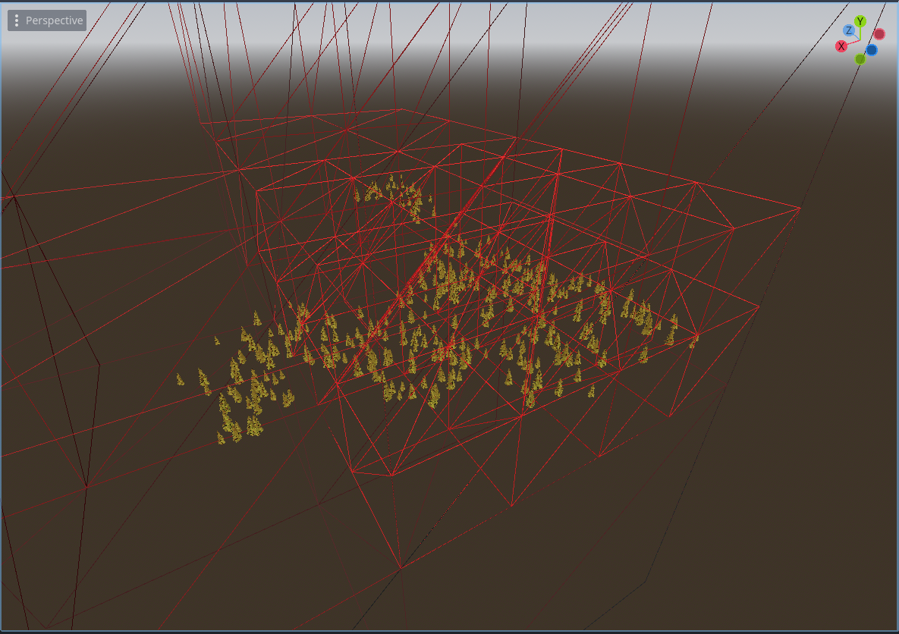

# What's it?
This is a Godot project that includes several plugins to implement an open world game. These developments are based on articles and tutorials from open access.
The goal of this project is to implement systems and mechanics inherent in most games in the survival/sandbox genre.

# Demo

The gif below shows the terrain being rendered in real time.

# Run

Godot version 4.2 is required to run the project.

# Features

## Terrain

The Terrain system is designed from scratch to achieve maximum flexibility and performance.
Terrain is based on a height map. The calculation of heights and normals takes place in the surface shader.
This makes it possible to change the shape of the terrain in real time.

The quality of the terrain mesh is calculated by a quadtree. It depends on the distance to the observer and can be adjusted.

Terrain has an offset parameter that allows you to create a seamless sequence of several terrans. Since each of the terrains is processed separately, this can give a performance boost. Potentially, the size of the terrine is not limited.

## Vegetation

GPU instancing allows for a large amount of vegetation in the scene. The space is split using octree. The nodes of the octree contain data such as transformation and LOD required for GPU instancing. Although the plant meshes are essentially combined, the algorithm can also process them as separate objects, i. e. plant objects exist on the scene with collisions and scripts. Each plant can be processed using a custom script.

